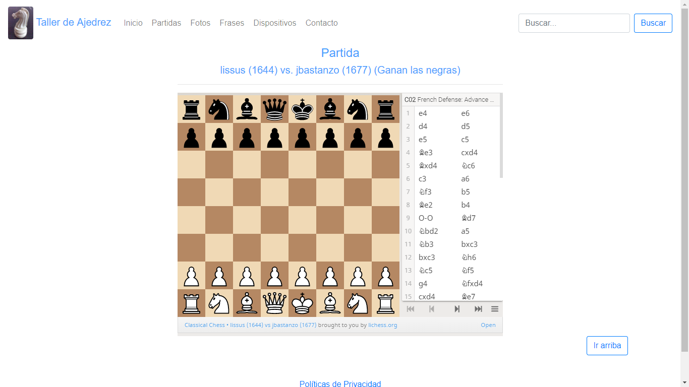
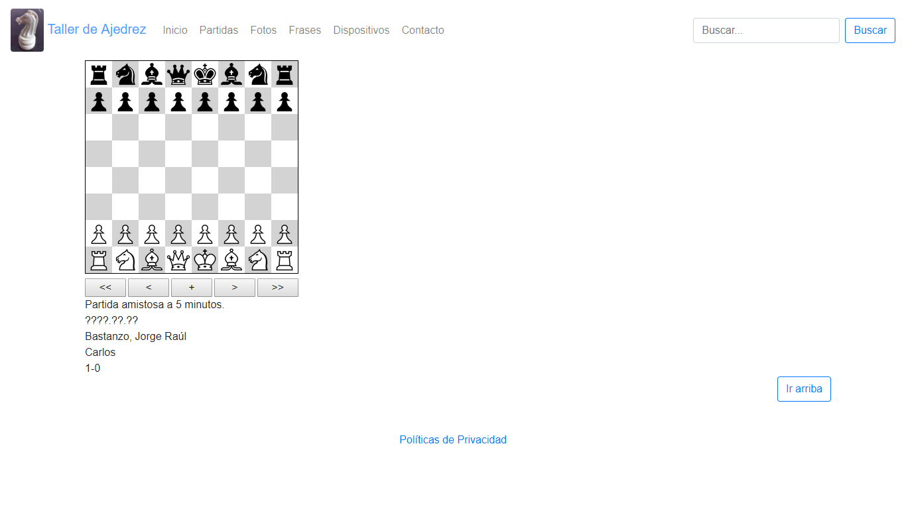

# Taller de Ajedrez (Versión Actual)
https://tallerdeajedrez.com.ar

El 16 de mayo de 2019 cambié el visor de partidas.
El problema es que, con el visor anterior, dependía de un sitio externo; ahora no.
Debajo las capturas de pantalla:

Visor Anterior:

Visor Nuevo:

